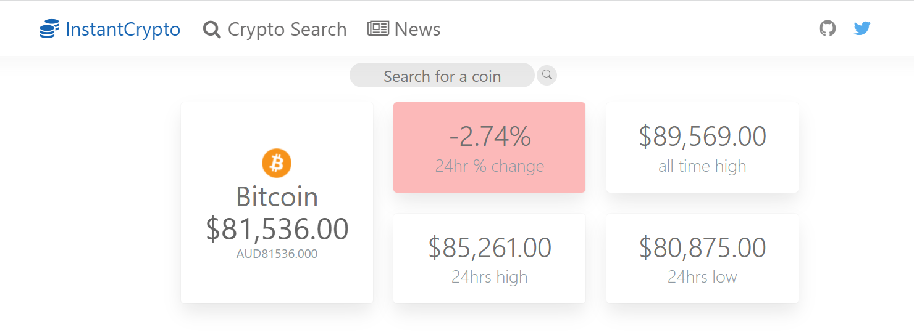
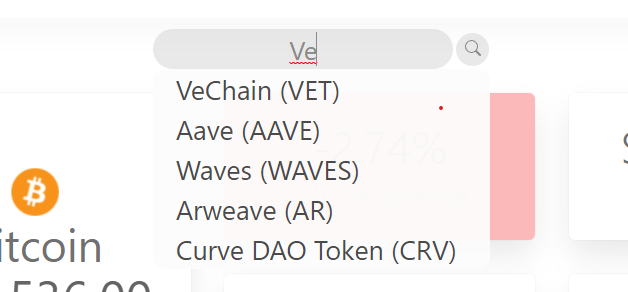
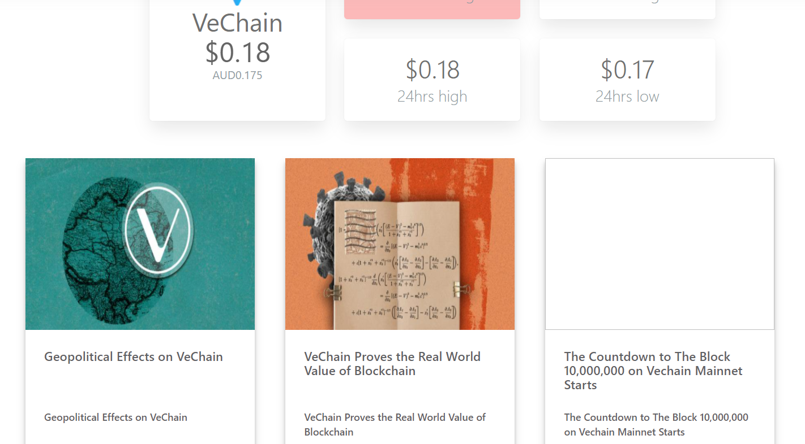
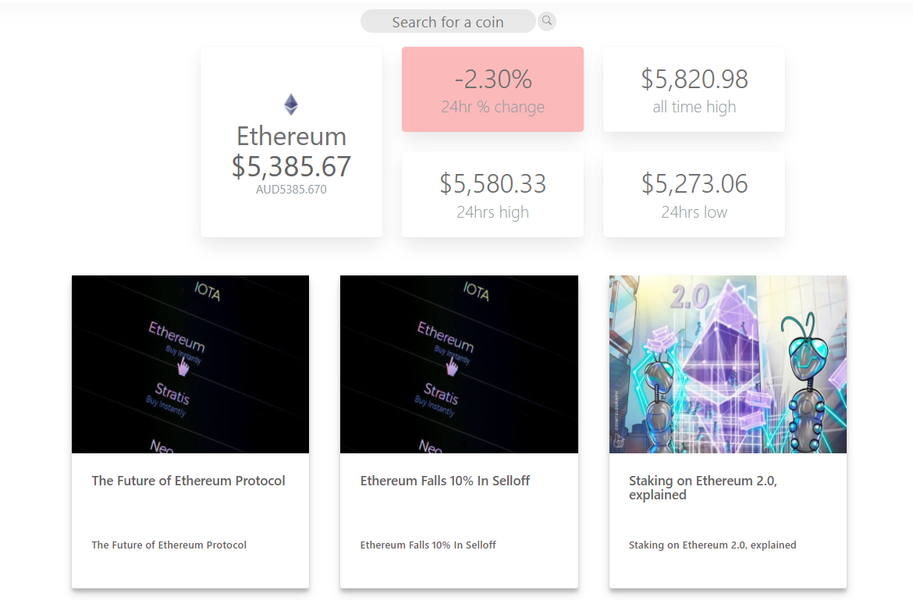
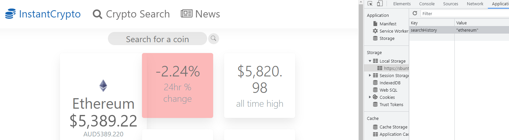
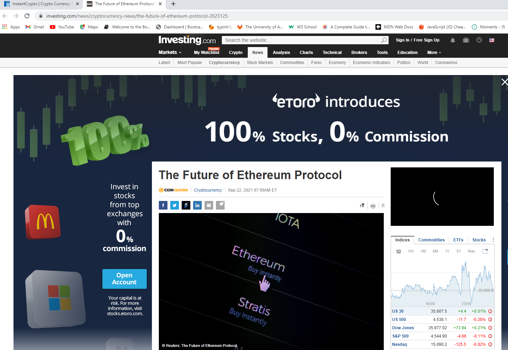

# <Group Project 1 - InstantCrypto >

## Description
Working in a small group we were given the opportunity to create and develop a web-application of our choosing.

The project had to include the following: 
-Use a CSS framework other than Bootstrap 
-Be interative (i.e accept and respond to user input)
-Use at least two serive-side API's
-Does not use alerts, confirms or prompts
-Use client-side storage to store persisent data 
-Be responsive 
-Have a polish UI 
-Be deployed to GitHub Pages 
-Have a clean repository that meets quality coding standards 
-Have a quality README 

Our motivation was to make an application that highlighed all the skills and knowledge we have learnt so far in our web-development journey. 

We decided to build our project around 2 seperate elements that logically blend well together, but in the real world do not appear to be common. We paired cryptocurreny data with recent and relevant news articles related to a specific cryptocurrency. This would allow a user to have a more streamlined experience and stay in one place, rather than checking the value of their currecny and then having to open a new application to find out why the value has changed or increased. 

There were a number of problems that had to be resoloved in order to successfully launch the web-application; InstantCrypto. 
1) Finding the correct server-side API's that would allow us to extract the neccessary data to use in our application.
2) Understanding and execusting git branching and merging while working in a team enviroment. 
3) Ensuring that all memebers of the project understood the desired outcome and were able to effeciently work towards the outcome. 
4) Fiding a CSS framework that was not Bootstrap. 

Depsite these probems we were able to overcome them to successfully create and launch our application. In doing so we learnt many skills that will help us to futre develop as web developers. A standout leaning outcome was when using serve-side APIs it is important to have a firm understanding of its documentation. This is important to understand as it highlights what is included as well with the API as well as limitations, for example; how many API calls are included and if you exceed these calls what happens. Another important lesson was how to successfully use Git branching / merging and why it is important as well as how to resolve any conflicts that can occur.  

## Usage
The user opens up the application and is presented with a default cryptocurrency (Bitcoin) and is presented with an array of data. The data presented is; current price (presented in AUD), % price change for the past 24hours (if negative change tile will be red, if positive tile will be green), all time high price and finally the 24 hour high and low price. 

The user is then able to search any cryptocurreny using the search bar to bring up the data for the respective coin they search, such as VeChain. An autocomplete was also included in the search bar for the users convenience.  

Once the user confirms the coin they want to search, the new data is displayed. 

Under the cryptocurrecny data the user can find recent and relevant news articles related to the searched coin. 

If the user decides to search for a new coin, they enter a coin into the search bar, click on the search icon, and then will be displayed with the new coin data as well as news articles realted to that coin. 

If the user refreshes the landing page, the most recent search is stored in local storage and will persist on the page. 

If the user clicks on the desiered news article a new landing page window opens and they are taken to the new article. Note; InstantCrpyto landing page does not close. 

## Credits
The collaborators for this project were: 
Stefanie Buntz - https://github.com/sbuntz 
Joseph Daw - https://github.com/josephdaw
Michael West - https://github.com/mjhwest
Gurtej Thandi - https://github.com/gurtej154

Crytocurrency data was collected using:
https://www.coingecko.com/en/api

News article data was collected using: 
https://mediastack.com/

## Features
-HTML
-CSS 
-Bulma 
-Font Awesome 
-JQuery 
-Server-side API's
-Git Branching Workflow 
-Agile Software Development 

